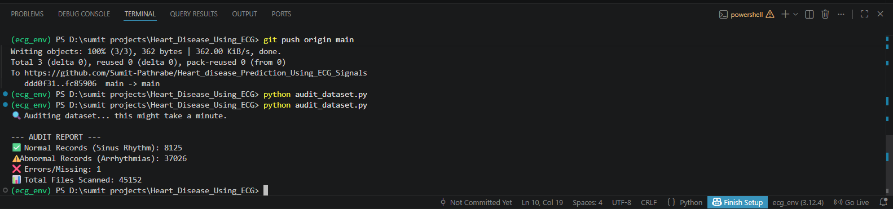
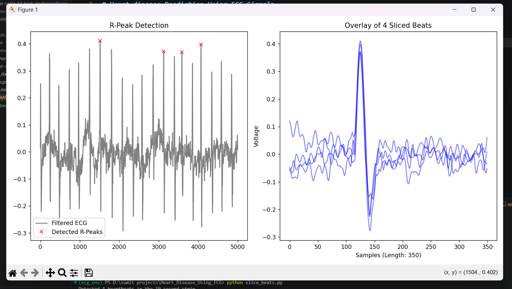
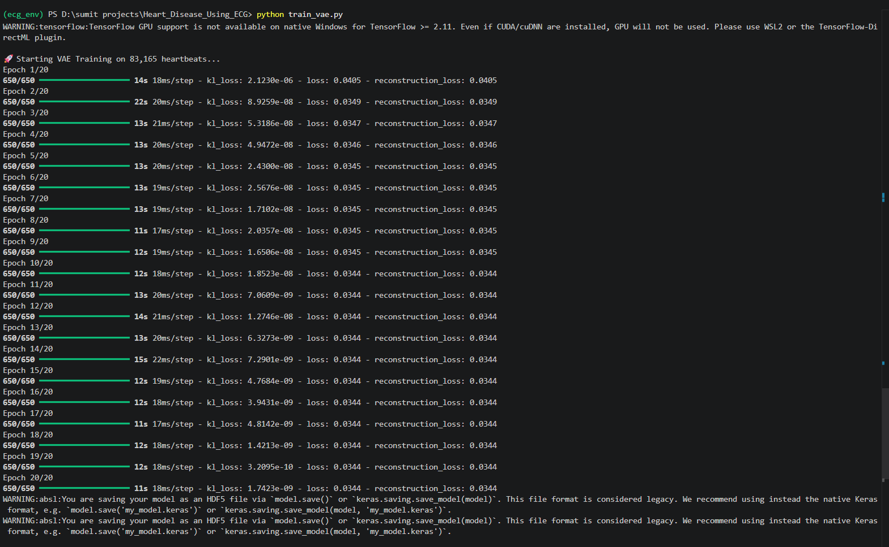
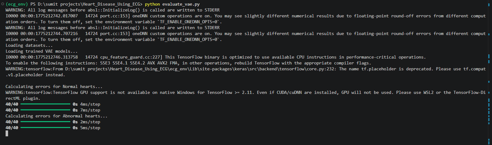
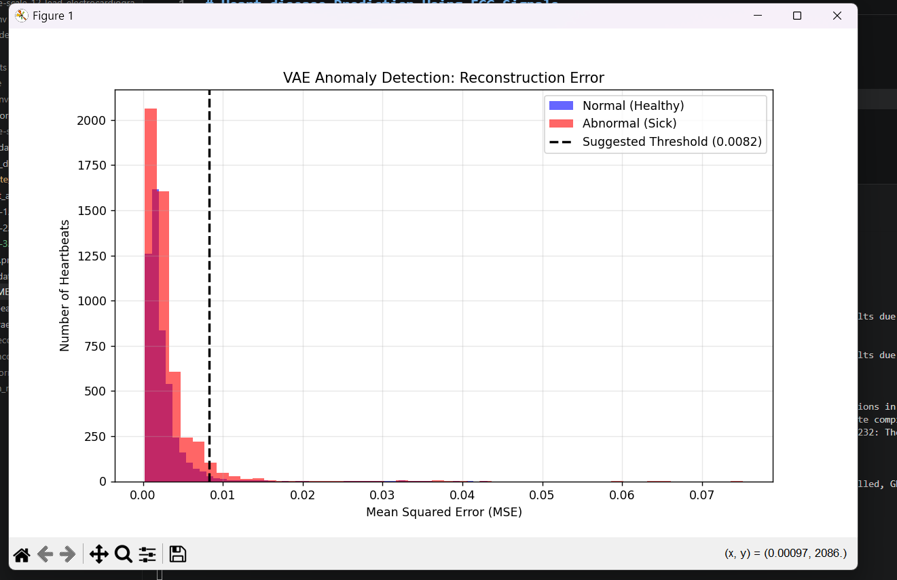
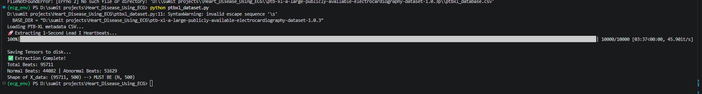
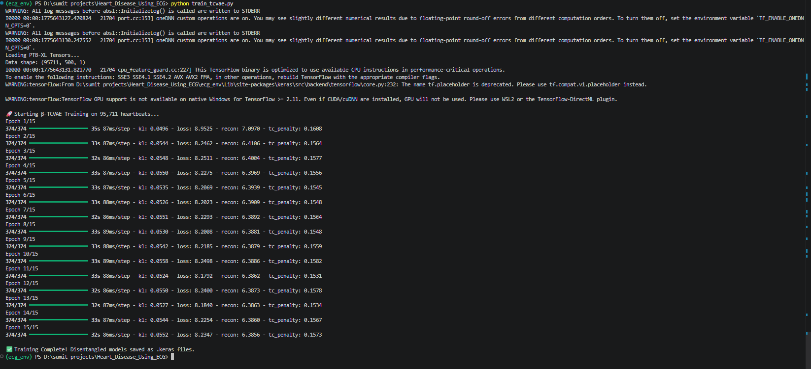
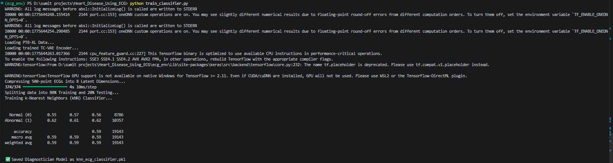
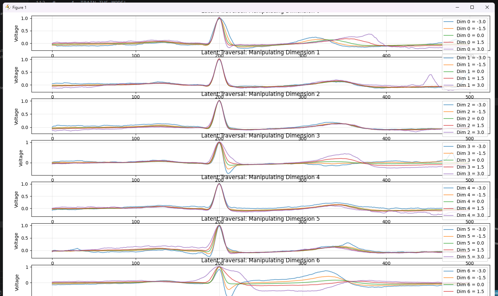

#  Heart Disease Prediction Using ECG Signals

##  Overview
This project focuses on predicting heart disease using Electrocardiogram (ECG) signals and Machine Learning techniques. ECG signals represent the electrical activity of the heart and help in identifying abnormalities. The system uses ML models to analyze ECG data and predict the presence of heart disease.

---

##  Objectives
- Analyze ECG signal data  
- Preprocess and clean the dataset  
- Extract meaningful features from ECG signals  
- Train machine learning models  
- Evaluate model performance  
- Predict heart disease accurately  

---

##  Technologies Used
- Python  
- NumPy  
- Pandas  
- Matplotlib / Seaborn  
- Scikit-learn  
- Jupyter Notebook / Google Colab  

---

##  Dataset
- ECG signal dataset used for classification  
- Contains labeled data for normal and abnormal heart conditions  

---

##  Project Workflow

### 1. Data Collection
- Load ECG dataset  
- Understand features and structure  

### 2. Data Preprocessing
- Handle missing values  
- Normalize and scale data  
- Remove noise  

### 3. Feature Extraction
- Extract important ECG signal features  
- Improve signal quality  

### 4. Model Building
- Logistic Regression  
- Support Vector Machine (SVM)  
- K-Nearest Neighbors (KNN)  

### 5. Model Evaluation
- Accuracy  
- Precision  
- Recall  
- Confusion Matrix  

### 6. Prediction
- Input ECG signal  
- Output prediction (Heart Disease / No Disease)  

---

##  Results
- Achieved good accuracy in heart disease prediction  
- Compared multiple models to select the best one  

---

Dataset loading and audit_scanning 
R-Peak Detection and Windowing.

Training VAE MODEL 
VAE MODEL RESULTS

